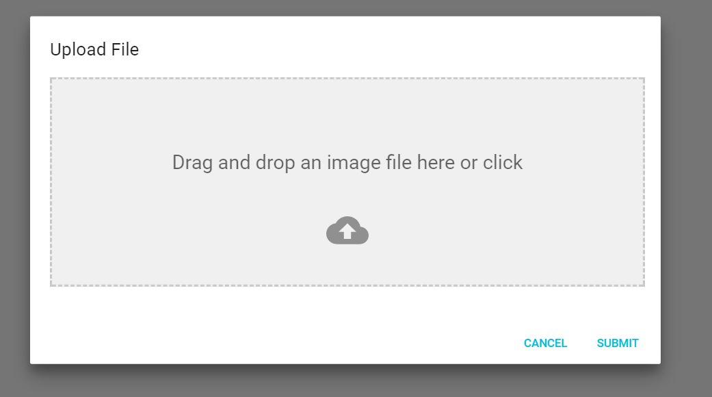

# material-ui-dropzone
Material-UI-dropzone is a [React](https://github.com/facebook/react) component using [Material-UI](https://github.com/callemall/material-ui) and is based on the excellent [react-dropzone](https://github.com/react-dropzone/react-dropzone) library.

The component is a modal containing a file upload (dropzone) area and some snazzy "File Allowed/Not Allowed" effects.

#Installation
```sh
npm install material-ui-dropzone
```

#Screenshots
This is the component:
  

When you drag a file onto the dropzone, you get a neat effect.
  


And if you drop in a wrong type of file, you'll get yelled at.


#Usage
```jsx
import DropZoneModal from '../../src';
import React, {Component} from 'react';
import RaisedButton from 'material-ui/RaisedButton';
import {MuiThemeProvider} from 'material-ui';

export default class Main extends Component {
    constructor(props) {
        super(props);

        this.state = {
            openUploadModal: false,
            files: [],
        };
    }

    closeDialog() {
        this.setState({openUploadModal: false});
    }

    saveFiles(files) {
        //Saving files to state for further use and closing Modal.
        this.setState({files: files, openUploadModal: false});
    }

    handleOpenUpload() {
        this.setState({
            openUploadModal: true,
        });
    }

    deleteFile(fileName) {
        this.props.deleteFile(fileName);
    }

    render() {
        //If we already saved files they will be shown again in modal preview.
        let files = this.state.files;
        let style = {
            addFileBtn: {
                'marginTop': '15px',
            },
        };

        return (<MuiThemeProvider>
                <div>
                    <RaisedButton style={style.addFileBtn} label={'Add Image'}
                                  onTouchTap={this.handleOpenUpload.bind(this)}/>
                    <DropZoneModal
                        open={this.state.openUploadModal}
                        saveFiles={this.saveFiles.bind(this)}
                        deleteFile={this.deleteFile.bind(this)}
                        acceptedFiles={['image/jpeg', 'image/png', 'image/bmp']}
                        files={files}
                        showPreviews={true}
                        maxSize={5000000}
                        closeDialog={this.closeDialog.bind(this)}
                    />
                </div>
            </MuiThemeProvider>
        );
    }
}
```


#TODO
* Add some more tests

#License
MIT
